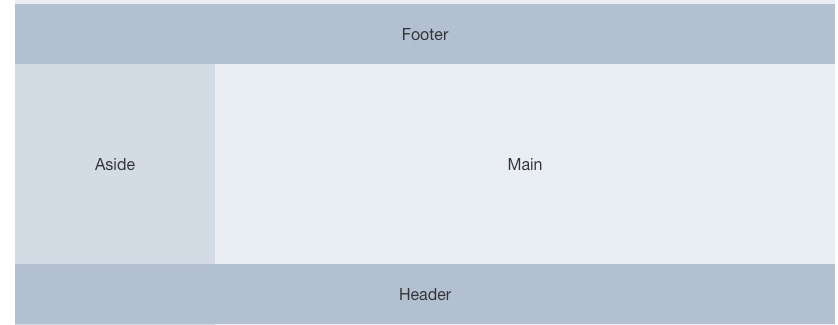

## 图示结构怎么实现



Container组件检测是否含有side组件,如果有则添加has-sider类名

```javascript
export default {
  name: "Container",
  data(){
    return {
      layoutClass:{
        hasSider: false
      }
    }
  },
  mounted() {
    this.$children.forEach((vm)=>{
      if(vm.$options.name === 'sider'){
        this.layoutClass.hasSider = true
      }
    })
  }
}
```
hasSider的css

```scss
  .layout {
    flex-grow: 1;
    display: flex;
    flex-direction: column;
    &.hasSider{
      flex-direction: row;
    }
  }
```
